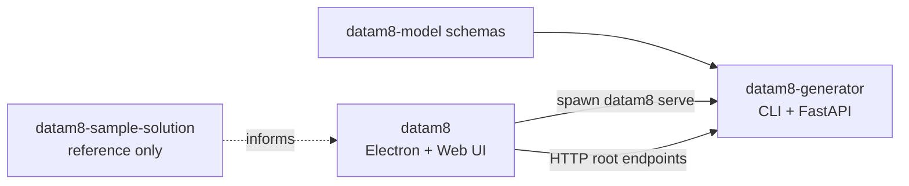

## Purpose
`datam8` is the UI/Electron shell for DataM8 2.0. It opens `.dm8s` solutions, edits base + model entities, and calls the backend over HTTP.

## How the Repositories Fit Together (v2)
- `datam8-model`: source-of-truth schemas for v2 solution/base/model shapes.
- `datam8-sample-solution`: reference implementation of a v2 solution; use for understanding structure, not as a test dependency.
- `datam8-generator`: canonical backend (`datam8` CLI + FastAPI).
- `datam8`: desktop/web editor. Starts `datam8 serve --host 127.0.0.1 --port 0 --token ...` and calls backend root endpoints.

Data flow:
- Electron spawns backend (`python -m datam8 serve`) and reads readiness JSON (`baseUrl`, `version`).
- Electron passes `baseUrl` + token to renderer via preload.
- Web UI loads and edits solution/base/model via root HTTP endpoints (no `/api/*`).
- Generation and other operations are synchronous HTTP calls (no Jobs/SSE layer).

Canonical backend contract:
- `submodules/datam8-generator/docs/backend-contract.md`
- Frontend mirror/link doc: `docs/backend-contract.md`

## Scope Rules
- UI-only requirement: change Frontend only.
- Core `generate`/`validate`/`index` semantics: change Generator only; Frontend only wiring.
- User feature spanning backend + UI: change both repos, update backend contract doc, and add end-to-end coverage.
- Contract change: update canonical generator contract doc first, then coordinated code changes and contract/e2e tests.

## Test Rules (Test What You Ship)
- Frontend-only change: add/adjust UI/component/integration tests; critical user flows need Playwright.
- Backend-only change: add/adjust generator unit/integration tests.
- Cross-repo change: include at least one end-to-end flow test:
  - `UI -> request -> backend completion -> output/state assertions`.

## Patch Checklist
- Contract impact assessed and documented (`docs/backend-contract.md` canonical in generator).
- Scope respected (UI vs backend semantics not mixed).
- Tests added/updated for changed behavior.
- Docs updated without duplicating canonical backend contract text.

## Subsystems & Directories
- **Web UI (`apps/web`)**
  - Entry/layout: `src/app/AppShell.tsx`, `src/main.tsx`.
  - State: `features/solution`, `features/model/ModelEditorContext.tsx`, `features/generator/GeneratorContext.tsx`, `features/fs/FileSystemContext.tsx`.
- **Desktop (`apps/desktop`)**
  - Main process: `src/main.ts` (spawn backend, parse readiness, pass `baseUrl` + token).
  - Preload bridge: `src/preload.ts`.
  - Packaging: release artifacts in `apps/desktop/release`.
- **Backend submodule (`submodules/datam8-generator`)**
  - Source of truth for backend behavior and API contract.

## Operational Notes
- Solution picker uses `GET /fs/list` and stores last path under `dm8_solution_path`.
- Save/Save All act on tab dirty state.
- Generator panel uses synchronous `POST /generate`.

## Quick Run / Test
- `npm run dev:desktop`
- `DATAM8_PYTHON_PATH=/abs/path/to/python npm run dev:desktop`
- `npm run typecheck`
